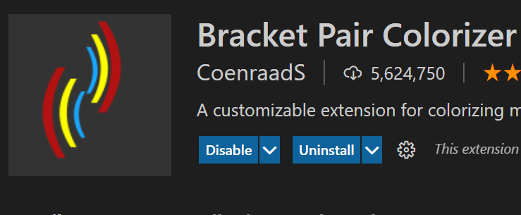
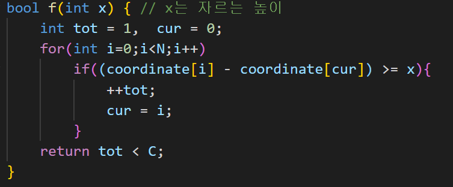
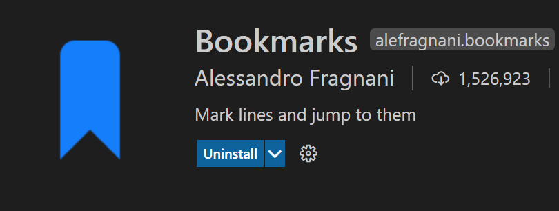

# VSCode 확장팩 추천
---

## 1. Bracket Pair Colorizer

다음과 같이 페어 브라켓에 같은 색을 칠해주는 확장팩이다.

중괄호가 난무하는 코드에서 빛을 발한다.

## 2. Bookmarks

ctrl + alt + l 로 북마크끼리 이동이 가능하며 VS code 우측 상단에 생기는 아이콘을 통해 북마크를 관리할 수 있다.